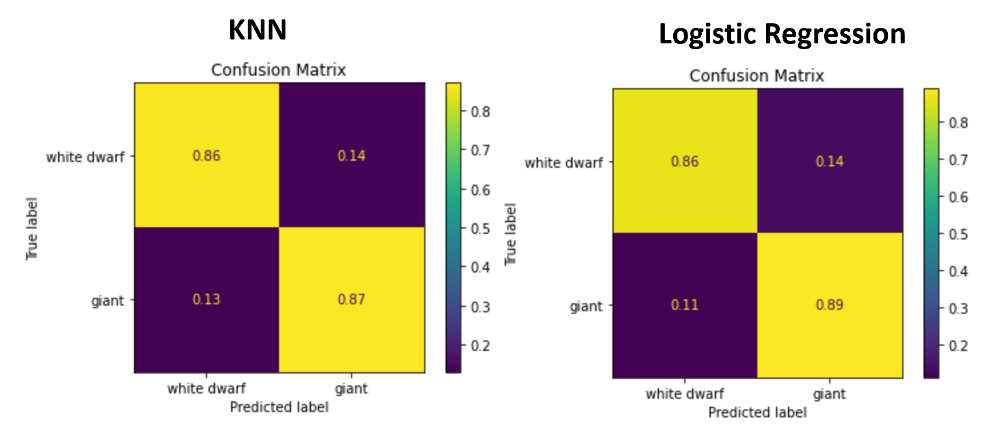
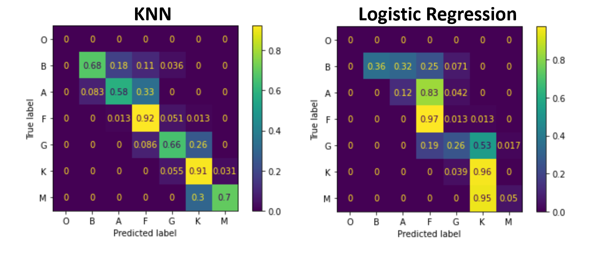

# Quantum-enhanced Support Vector Machines for Stellar Classification


## Table of Contents

1. [Introduction](#sec1)

2. [Types of Stars and Current Methods of Classification](#sec2)

3. [Feature Engineering](#sec3)

4. [Results](#sec4)

   ​	[Quantum Kernel Learning for Large Dataset](#sec41)

   ​	[GPU Acceleration with cuQuantum for Quantum Kernel Encoding](#sec42)

5. [Discussion](#sec5)

   ​	[Classical Model for Benchmarking with two-labelled classification](#sec51)

   ​	[Classical Model for Benchmarking with multi-labelled classification](#sec52)
   	
   ​	[Result of Quantum Kernel Learning for Multi-labelled Classification](#sec53)

   


## Introduction <a name="sec1"></a>

This project aims to investigate the feasibility of employing quantum-enhanced support vector machines (QSVMs) for stellar classification based on spectral data from the open source dataset[^1]. The core of the study involves designing and implementing a novel QSVM algorithm, which will be compared to traditional SVMs and Morgan–Keenan (MK) classification system, that is conventionally used in the field of stellar classification. Furthermore, the project seeks to explore the potential GPU acceleration techniques for the task of QSVM model training. Ultimately, this study will attempt to demonstrate the potential of quantum computing in enhancing the precision and efficiency of machine-learning approaches in astronomy.

You can find our final project [here](./QHack_Project_Result_2023.pdf).

## Types of Stars and Current Methods of Classification <a name="sec2"></a>

Stellar classification is based on a star's spectrum, which reveals its temperature, luminosity, and chemical composition[^2]. The Harvard spectral classification divides stars into seven categories based on the strengths of their spectral lines. Each spectral type corresponds to a range of temperatures and luminosities, and stars can be further divided based on their luminosity class. The Hertzsprung-Russell Diagram is a fundamental tool for studying stellar evolution, and stars are classified based on their spectral types and luminosities (shown below[^3]). Human analysis of spectra can be time-consuming and subject to variability, so machine learning techniques like SVMs have been used to automate the process. However, traditional SVMs have limited performance and scalability, so there is a need to explore novel approaches like quantum-enhanced SVMs.


## Feature Engineering<a name="sec3"></a>

In order to facilitate quantum kernel learning, classical pre-processing methods can be utilized to decrease the dimensionality of the data or extract pertinent features prior to quantum kernel training. This approach can decrease the computational load and enhance the model's accuracy by decreasing noise and uncertainty associated with the quantum data. A technique for preparing the data for quantum kernel learning is to convert the quantum state into a different representation that is more suitable for machine learning methods. This may involve applying quantum circuits or other transformations to the data to extract valuable features.

There are 6 attributes provided in the original dataset. We believe only 2 of them, `B-V` and `Amag`, are relevant to the classification. They represents the B-V color index and absolute magnitude of the star, respectively. In addition,  we defined 4 more composite attributes. They are:
```math
\begin{align}
		&\texttt{Amag\_SQ} = \texttt{Amag}^2\\
    &\texttt{B-V\_SQ} = \texttt{B-V}^2\\
    &\texttt{B-V+Amag} = \texttt{B-V} + \texttt{Amag}\\
    &\texttt{B-V-Amag} = \texttt{B-V} - \texttt{Amag}
\end{align}
```


A detailed analysis of the relationship between target classification and other features is necessary, and a figure providing a visual representation of this relationship is shown below. We can find that composite features play a critical role in successfully amplifying even small variations, leading to further separation of peaks in the data. This suggests that composite features can improve the accuracy of target classification, especially in challenging cases.


## Results <a name="sec4"></a>

### Quantum Kernel Learning for Large Dataset <a name="sec41"></a>

Our quantum kernel learning approach for star classification shows improved performance with increasing training data, surpassing the classical kernel in accuracy, f1 score, and specificity. The quantum kernel remains stable at around 0.9 in sensitivity, indicating its robustness. Our results suggest the superiority of the quantum kernel, which is more stable than the classical kernel, due to its ability to efficiently capture and process complex features.

<p align=center></p>
<p align=center></p>
<p align=center></p>
<p align=center></p>


### GPU Acceleration with cuQuantum for Quantum Kernel Encoding<a name="sec42"></a>

Quantum computing has potential in solving complex machine learning problems, but training quantum models is computationally intensive and requires specialized hardware. Quantum kernel learning, a technique that pre-processes data using classical hardware before training a quantum kernel, has shown promising results. CuQuantum is a software library that enables training of quantum models on NVIDIA GPUs, leading to faster and more accurate predictions. The speedup is due to the parallel processing power of GPUs, and using CuQuantum and CUDA also reduces computational cost, making quantum kernel learning more accessible and scalable.

The following figure shows the GPU speedup for kernel encoding by cuQuantum compared to CPU:

<p align=center></p>


# Discussion <a name="sec5"></a>

### Classical Model for Benchmarking with two-labelled classification<a name="sec51"></a>

#### K-Nearest Neighbors (KNN)<a name="sec511"></a>

KNN is a widely used non-parametric algorithm for classification and regression tasks, including star classification. It works by finding the K closest neighbors based on features such as magnitude, color, and distance, and assigning the class of the test star based on the most common class among the neighbors. However, the performance of KNN depends on the choice of K and distance metric, which can lead to overfitting or underfitting

 In the context of star classification, KNN has shown promising results due to its simplicity and interpretability. The performance of our KNN model on the large star dataset is shown below. Accuracy increases as K decreases, with the highest accuracy of 86.5% achieved when K = 15. We have selected K = 15 as the optimal parameter for star classification. However, the optimal value of K can vary depending on the dataset and classification problem. Nonetheless, KNN remains a simple and effective classification algorithm that can provide accurate result

<p align=center></p>


#### Logistic Regression (LR)<a name="sec512"></a>

Logistic Regression is a popular classification algorithm for binary outcomes, such as predicting whether an email is spam or not. It models the probability of the positive outcome using a logistic function and estimates the parameters using maximum likelihood estimation. Logistic Regression can also provide insights into feature importance, which can help identify the most relevant features for the task at hand and interpret the model's results. The figure below shows the feature importance of our classification LR model.

<p align=center></p>

### Classical Model for Benchmarking with multi-labelled classification<a name="sec52"></a>

In benchmarking, the accuracy of both Ken and LR models on two-labelled classification can reach 

In the benchmarking result, we can observe that both KNN and LR models perform well for two-labelled
classification, achieving an accuracy of around 0.86. However, when it comes to multi-labelled classification,
the accuracy drops to 0.78 and 0.79 for KNN and LR, respectively.





### Result of Quantum Kernel Learning for Multi-labelled Classification <a name="sec53"></a>

With quantum kernel learning, we can achieve an accuracy of approximately 0.81, which is 5% higher than the classical benchmarking methods. Furthermore, we observed that our quantum model exhibits improved classification performance in star types A\&F and K\&M (shown in the figure below), as compared to KNN and LR, respectively.

<p align=center></p>


### QCNN for Multi-labeled Star Classification <a name="sec53"></a>

<p align=center></p>

The provided code defines a neural network model that is used for quantum circuit learning. The model consists of several layers of convolutional and linear (fully connected) layers, along with a custom-defined TorchCircuit module that is used to implement quantum circuits. The architecture of the model is as follows:
```python
class Net(nn.Module):
    def __init__(self):
        super(Net, self).__init__()
        self.conv1 = nn.Conv1d(1, 16, kernel_size=2)
        self.pool1 = nn.MaxPool1d(kernel_size=1)
        self.conv2 = nn.Conv1d(16, 32, kernel_size=2)
        self.pool2 = nn.MaxPool1d(kernel_size=1)
        self.fc1 = nn.Linear(128, 50)
        self.fc2 = nn.Linear(50, NUM_QUBITS)
        self.qc = TorchCircuit.apply
        self.qcsim = nn.Linear(NUM_QUBITS, 1)
        self.fc3 = nn.Linear(1, 4)
```

<p align=center></p>

At the beginning of training, the model has a loss of 2.5351 and an accuracy of 53.29 percent. As the model trains, we can see that the loss decreases and the accuracy increases with each epoch. After the first epoch, the model's accuracy improves significantly to 68.50 percent, and the loss also drops to 2.4993. The model continues to improve its accuracy in subsequent epochs, reaching 74.13 prcent accuracy by the end of training. The loss also steadily decreases, indicating that the model is learning to make better predictions.


[^1]: W.-F. Ku, *Star categorization giants and dwarfs dataset*, vinesmsuic. https://www.kaggle.com/datasets/vinesmsuic/star-categorization-giants-and-dwarfs, Jul 2020.
[^2]: D. F. Gray, *The observation and analysis of stellar photospheres*, Cambridge University Press, 2021.
[^3]: Hoskin, M. The Cambridge concise history of astronomy. Cambridge University Press, 1999.

